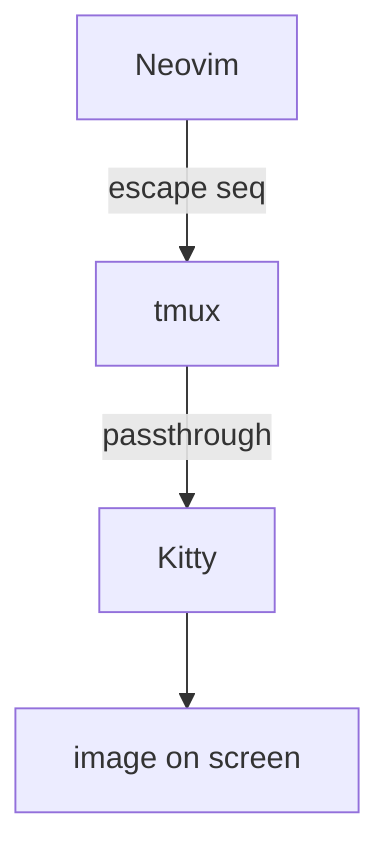

# Markdown Preview Demo

This file exercises all three rendering layers. Open it in **Neovim inside Kitty**.

## 1. Text rendering (markview)

Headings, **bold**, *italic*, `inline code`, and links like [oxocarbon](https://github.com/nyoom-engineering/oxocarbon.nvim) all get styled in-buffer.

- [ ] an unchecked task
- [x] a checked task
- a plain bullet

> A block quote gets a colored bar on the left.

### A table

| Layer   | Plugin        | Renders            |
| ------- | ------------- | ------------------ |
| text    | markview.nvim | headings / tables  |
| images  | image.nvim    | png / svg / jpg    |
| diagram | diagram.nvim  | mermaid -> image   |

### A code block

```lua
local function hello(name)
    return "hi, " .. name
end
```

## 2. Diagram rendering (diagram.nvim + mmdc)

This mermaid block should render as an actual drawn diagram, not raw code:



## 3. Image rendering (image.nvim)

Any local image path will draw inline, e.g.:


